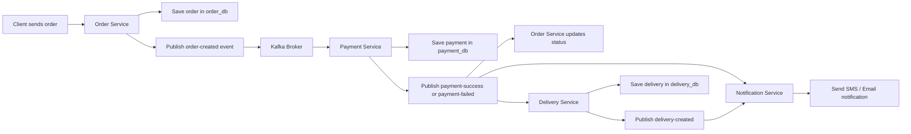

# Kafka Order Processing Demo

A Java 17 / Spring Boot microservices demo. Orders are saved by the Order Service, then Kafka events coordinate payment, order-status updates, delivery creation, and simulated SMS/email notifications.

## Architecture



See [docs/architecture.md](docs/architecture.md) for the same diagram in a dedicated docs file.

### Services

| Service | Port | Responsibility | Database |
| --- | ---: | --- | --- |
| Order Service | `8081` | Validates and saves orders, publishes `ORDER_CREATED`, then updates order status from payment events. | `order_db` |
| Payment Service | `8082` | Consumes new orders, simulates payment, saves payment results, and publishes success or failure. | `payment_db` |
| Delivery Service | `8083` | Consumes successful payments, creates a delivery and tracking number, and publishes `DELIVERY_CREATED`. | `delivery_db` |
| Notification Service | `8084` | Consumes payment and delivery events and prints simulated SMS/email messages to its console. | None |

The databases and Kafka broker are shared infrastructure, but each service owns its own database/schema. Tables are created or updated by JPA (`spring.jpa.hibernate.ddl-auto=update`).

## End-to-End Flow

1. A client sends a valid JSON order to `POST http://localhost:8081/orders`.
2. Order Service validates the required fields, sets status to `CREATED`, writes the row to `order_db.orders`, and publishes an `ORDER_CREATED` event to `order-created`. The Kafka key is the generated order ID.
3. Payment Service consumes the event in group `payment-service-group`. It ignores an event whose event ID has already been recorded, then simulates payment:
   - Amount below `60000`: saves a successful payment and publishes to `payment-success`.
   - Amount `60000` or greater: saves a failed payment with reason `INSUFFICIENT_FUNDS` and publishes to `payment-failed`.
   - Amount exactly `55555`: throws a deliberate test exception before saving payment or publishing an outcome; Kafka retries it twice after the initial attempt.
4. Order Service consumes the payment result and changes the order status to `PAID` or `PAYMENT_FAILED`.
5. Notification Service consumes either payment result and prints simulated SMS and email output.
6. For `payment-success` only, Delivery Service creates a row in `delivery_db.deliveries` with status `CREATED` and tracking number `TRK-<orderId>`, then publishes `DELIVERY_CREATED` to `delivery-created`.
7. Notification Service consumes `delivery-created` and prints the tracking information and simulated notification output.

Kafka uses the order ID as the message key so events for the same order use the same partition. Separate consumer groups allow Order, Delivery, and Notification services to each receive their own copy of a payment event.

## Kafka Topics and Consumer Groups

| Topic | Producer | Consumer group | Consumer |
| --- | --- | --- | --- |
| `order-created` | Order Service | `payment-service-group` | Payment Service |
| `payment-success` | Payment Service | `order-service-payment-group` | Order Service |
| `payment-success` | Payment Service | `delivery-service-group` | Delivery Service |
| `payment-success` | Payment Service | `notification-payment-group` | Notification Service |
| `payment-failed` | Payment Service | `order-service-payment-group` | Order Service |
| `payment-failed` | Payment Service | `notification-payment-group` | Notification Service |
| `delivery-created` | Delivery Service | `notification-service-group` | Notification Service |
| `payment-success.DLT` | Not currently produced | None | Reserved topic only; dead-letter publishing is not configured |

The configured setup uses three partitions and replication factor one. The DLT topic is included in the creation commands for demonstration, but the current retry handler does not route exhausted records to it.

## Prerequisites

- JDK 17
- Apache Kafka running at `localhost:9092`
- MySQL running at `localhost:3306`
- Maven installed for the Delivery Service test command; the other services include Maven wrappers
- Windows PowerShell for the commands below

Create the service databases in MySQL:

```sql
CREATE DATABASE order_db;
CREATE DATABASE payment_db;
CREATE DATABASE delivery_db;
```

Set the MySQL root password in the same PowerShell session used to start the services:

```powershell
$env:DB_PASSWORD = "your-mysql-root-password"
```

Start Kafka and MySQL using your local installation. From your Kafka installation directory, create the topics:

```powershell
$topics = @("order-created", "payment-success", "payment-failed", "delivery-created", "payment-success.DLT")
foreach ($topic in $topics) {
  .\bin\windows\kafka-topics.bat --bootstrap-server localhost:9092 --create --if-not-exists --topic $topic --partitions 3 --replication-factor 1
}
```

Check that Kafka is reachable and the topics exist:

```powershell
.\bin\windows\kafka-topics.bat --bootstrap-server localhost:9092 --list
```

## Start the Application

From the repository root on the current machine:

```powershell
.\start-all.bat
```

This opens four command windows. The script currently uses the absolute path `E:\KafkaKW`. If the repository is somewhere else, open four terminals at the repository root and run one corresponding command in each terminal:

```powershell
Push-Location .\order-service; .\mvnw.cmd spring-boot:run
Push-Location .\payment-service; .\mvnw.cmd spring-boot:run
Push-Location .\delivery-service; mvn spring-boot:run
Push-Location .\notification-service; .\mvnw.cmd spring-boot:run
```

Run only one command per terminal; each command changes to its service directory and then starts that service. Wait for all four Spring Boot applications to finish starting. Order, Payment, and Delivery require their corresponding MySQL databases; all services require Kafka.

## Create and Test Orders

The only HTTP endpoint currently implemented is `POST /orders`; there are no order, payment, or delivery read endpoints. The endpoint returns the generated order ID and initial status. Use PowerShell `Invoke-RestMethod` to send requests.

### Successful payment and delivery

```powershell
$body = @{
  customerId = 101
  customerName = "Rahul"
  productId = 501
  productName = "Laptop"
  quantity = 1
  amount = 50000
  deliveryAddress = "Bangalore"
} | ConvertTo-Json

$order = Invoke-RestMethod -Method Post -Uri "http://localhost:8081/orders" -ContentType "application/json" -Body $body
$order
```

The immediate response should contain an `orderId` and `status` equal to `CREATED`. Processing is asynchronous. After Kafka consumers process the event, expect the order status to become `PAID`, a payment row to be saved, a delivery row with tracking number `TRK-<orderId>`, and payment and delivery notification logs.

### Failed payment

Send another order with `amount = 60000` (or more). Payment Service saves a failed payment, and publishes `payment-failed`. The order becomes `PAYMENT_FAILED`; Notification Service prints the failure messages. No delivery should be created.

```powershell
$body = @{
  customerId = 102
  customerName = "Asha"
  productId = 502
  productName = "Phone"
  quantity = 1
  amount = 60000
  deliveryAddress = "Chennai"
} | ConvertTo-Json

Invoke-RestMethod -Method Post -Uri "http://localhost:8081/orders" -ContentType "application/json" -Body $body
```

### Retry demonstration

Send an order with `amount = 55555`. Payment Service deliberately throws before writing a payment row. Its `DefaultErrorHandler` waits two seconds and retries twice (three processing attempts total). No success/failure event, payment record, or delivery is expected for this test order. Dead-letter publishing is not configured.

```powershell
$body = @{
  customerId = 103
  customerName = "Maya"
  productId = 503
  productName = "Tablet"
  quantity = 1
  amount = 55555
  deliveryAddress = "Pune"
} | ConvertTo-Json

Invoke-RestMethod -Method Post -Uri "http://localhost:8081/orders" -ContentType "application/json" -Body $body
```

### Inspect database results

Use MySQL to confirm persisted records (replace the example ID with the returned `orderId`):

```sql
USE order_db;
SELECT id, customer_id, amount, status FROM orders ORDER BY id DESC;

USE payment_db;
SELECT id, event_id, order_id, amount, payment_status, reason FROM payments ORDER BY id DESC;

USE delivery_db;
SELECT id, order_id, tracking_number, status FROM deliveries ORDER BY id DESC;
```

Check consumer groups from the Kafka installation directory:

```powershell
.\bin\windows\kafka-consumer-groups.bat --bootstrap-server localhost:9092 --list
```

Group IDs are created as consumers connect and process records, so the list may be empty or incomplete before the services have started.

## Run Tests

Each service is a separate Maven project; there is no root Maven aggregator. The current tests are Spring context-load smoke tests rather than full Kafka end-to-end tests. Run the commands from the repository root:

```powershell
Push-Location .\order-service; .\mvnw.cmd test; Pop-Location
Push-Location .\payment-service; .\mvnw.cmd test; Pop-Location
Push-Location .\delivery-service; mvn test; Pop-Location
Push-Location .\notification-service; .\mvnw.cmd test; Pop-Location
```

The test/application contexts may require the MySQL databases and Kafka settings to be available. For the full behavioral check, start Kafka, MySQL, and all four services, then run each of the three HTTP scenarios above and verify service logs and database rows.

## Troubleshooting

- **Database connection failure:** confirm MySQL is listening on port `3306`, the three databases exist, and `$env:DB_PASSWORD` is set in the service process environment.
- **Kafka connection failure:** confirm the broker advertises/reaches `localhost:9092` and all required topics are created.
- **Order remains `CREATED`:** inspect Payment Service logs first, then check the `order-created` topic and consumer group offsets.
- **No delivery or delivery notification:** only a `payment-success` event creates a delivery; failed and retry-test orders do not.
- **Retry-test message:** `55555` is reserved to trigger retry behavior; use another amount below `60000` for the normal success path.
- **DLT is empty:** expected with the current implementation; creating `payment-success.DLT` does not enable dead-letter routing by itself.
