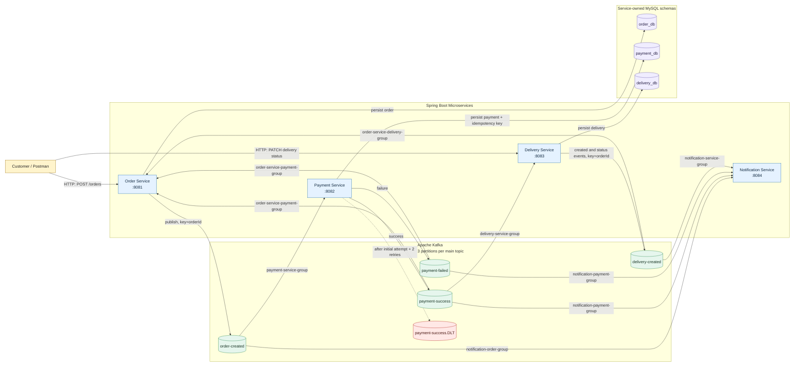

# Order Processing System - High-Level Design (HLD)

Kafka topic and consumer-group details are documented separately in [Kafka Topics and Consumer Groups](kafka-topics-and-consumer-groups.md).

## System Context

## Service Ownership

| Service | Owned data | Kafka responsibilities | HTTP interface |
| --- | --- | --- | --- |
| Order Service | Orders and order status | Produces `ORDER_CREATED`; consumes payment and delivery updates | `POST /orders` |
| Payment Service | Payments and processed event IDs | Consumes `order-created`; produces payment outcome; retries and dead-letters failures | None |
| Delivery Service | Delivery address, tracking number, status | Consumes successful payment; produces delivery lifecycle events | `PATCH /deliveries/{orderId}/status` |
| Notification Service | None | Independently consumes order, payment, and delivery events; prints simulated SMS/email | None |

## Reliability Notes

- Payment Service records processed event IDs and ignores repeated `ORDER_CREATED` messages. Delivery Service enforces one delivery per order.
- Payment handling retries twice after the initial attempt with a two-second fixed delay.
- Delivery status transitions are forward-only: `CREATED` to `IN_TRANSIT` or `CANCELLED`; `IN_TRANSIT` to `OUT_FOR_DELIVERY` or `CANCELLED`; `OUT_FOR_DELIVERY` to `DELIVERED` or `CANCELLED`. `DELIVERED` and `CANCELLED` are terminal.
- Databases are service-owned MySQL schemas. Kafka and MySQL are shared local infrastructure.